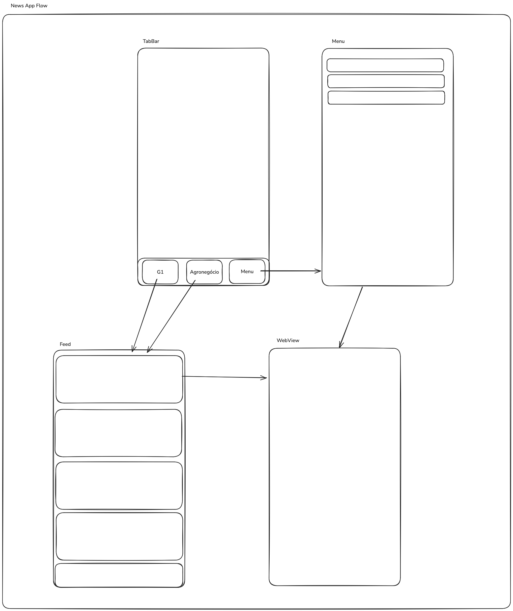

# Comentários

## Bibliotecas usadas no projeto

### [SnapKit](https://github.com/SnapKit/SnapKit)

Motivações para uso do **SnapKit** no projeto:

- Reduz *boilerplate* ao criar *constraints* programaticamente.
- Facilita leitura e manutenção da interface em *view code*.

## App Flow

