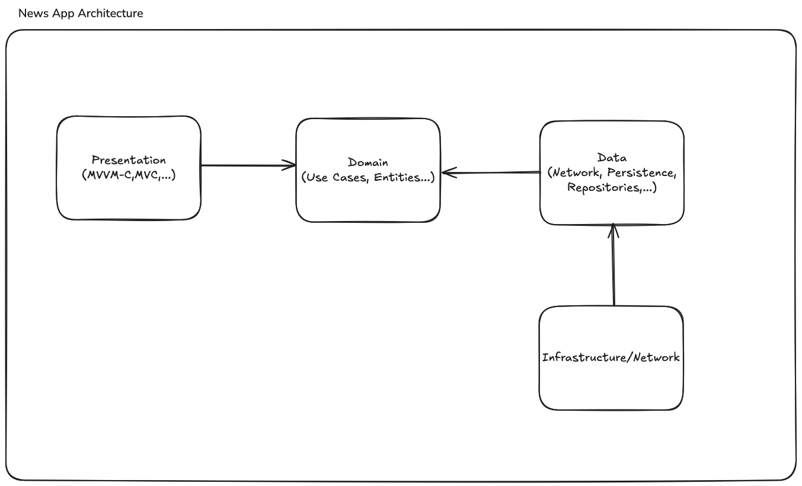

# Documentação

## Arquitetura



### Presentation Layer (MVVM-C / MVC)

- **Tabs 1 e 2**: exibem feeds com *scroll infinito* e *pull-to-refresh*.
- **Tab 3**: exibe um menu.
- **ViewModel**: recebe eventos da UI e aciona casos de uso
    (`getFeedPage()`, `getFeedNextPage()`).
  - Mantém estados: `items`, `isLoading`, `errorMessage`.
  - Garante deduplicação e atualização incremental da lista.
- **Coordination**: o *Coordinator* gerencia rotas entre módulos e ciclo de vida dos *ViewControllers*.

#### Feed (MVVM)

    ViewController/View -> ViewModel <- FetchFeedPageUseCase/FetchFeedNextPageUseCase

- Fluxo reativo com Combine.
- A *view* observa as propriedades definidas com `@Published` na ViewModel para atualização da UI.

#### WebView (MVC)

```ViewController + WKWebView <- URL```

- Responsável apenas por exibir conteúdo remoto, sem lógica de domínio.

------------------------------------------------------------------------

### Domain Layer (Use Cases / Entities)

- Contém a lógica de negócio pura e independente de frameworks.
- Entidades: `FeedPage`, `FeedItem` (imutable e decodable).
- Caso de uso principal:

        protocol FetchFeedPageUseCase {
            func execute(product: String, cursor: String?) -> AnyPublisher<FeedPage,NetworkError>
        }
- Define *Repository contracts* (protocolos) para abstrair acesso a dados.

------------------------------------------------------------------------

### Data Layer (Repositories / Network / Persistence)

- Implementa os *Repositories* definidos na camada de domínio.
- Combina múltiplas fontes: **remota** (API) e **local** (cache).
- Mapeia **DTOs -> Entities**, trata erros.
- **Cache**:
  - Persiste páginas e seus itens -- CoreData.

------------------------------------------------------------------------

### Infrastructure Layer / Network

- Cliente server utilizando  `URLSession` e Combine.
- Monta requests com `Endpoint` abstraindo *path*, *methods* e *headers*.
- Faz decodificação genérica de JSON em DTOs.
